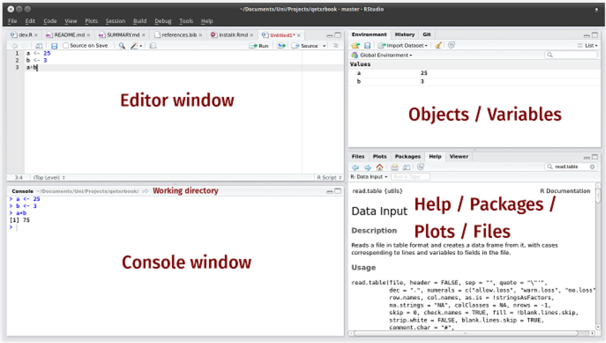

```{r setup, include=FALSE}
options(htmltools.dir.version = FALSE)
knitr::opts_chunk$set(dpi=300,fig.width=7)
```

```{r xaringan-themer, include = FALSE}
library(xaringanthemer)

write_xaringan_theme(text_bold_color = "black",
                     code_font_size = "0.9em", #   code_font_size = "0.55em",

                     text_font_google  = google_font("Fira Sans","300", "300i"),
                     header_font_google = google_font("Fira Sans"), 
                     code_font_google   = google_font("Droid Mono"),
                     text_slide_number_color = "grey",
                     code_highlight_color = "#D0ECE7",
                     background_color = "#FFFFFF",
                     header_color = "black",
                     inverse_background_color = "#12419E",
                     header_h1_font_size = "48px",
                     header_h2_font_size = "35px",
                     header_h3_font_size = "25px",
                     padding = "1em 2em 1em 2em")
```
<!-- Comienzo -->

---

## Programa del Curso

- Introducción a R.

- Instalación, entorno y estructura de datos.

- Lectura y Manipulación/Transformación de datos.

- Funciones y familia Apply.

- Visualización con ggplot2.

- Reportes (R Markdown).

- Extras dentro de cada clase.

---
## Clases

- Cada clase tendrá una parte expositiva, ejercicios en conjunto y actividades.

- Si hay dudas, interrumpir. **No existen preguntas tontas!**.

- **Todos** escribiremos código.

- Todo el material estará en la página del curso.

---
class: inverse, center, middle

# Introducción a R 

---

## ¿Por qué R?

- R es un lenguaje de programación para Computación Estadística.

¿ Existen programas similares, por qué usar R? 

- R es **Gratis**.

- Existe una gran comunidad que lo utiliza.

- Puede manejar prácticamente cualquier formato de datos.

- Es un lenguaje, por lo que puede hacer todo.

- Es un buen trampolín para otros lenguajes como Python.

---
## Descarga e Instalación
```{r echo=FALSE, out.width = "500px",fig.align="center"}

```

- R es el motor. (<https://cran.r-project.org>).

- RStudio es el panel de control. (<https://rstudio.com>).

- La instalación es como cualquier programa.

- Existe tambien <https://rstudio.cloud>.

---

## Interfaz de RStudio

```{r echo=FALSE, out.width = "900px"}

```
---
class: inverse, center, middle

# Estructura de Datos 

---
## Vectores
 Los vectores los creamos con elementos del mismo tipo a través de la función **c( )** (concatenar). En caso de mezclar caracteres con datos numéricos, el vector se considerará caracter.
 
```{r}
vec <- c(1,4,3.14,-2)  # <- es equivalente a usar =
vec
```
Dimensión/largo del vector
```{r}
length(vec)
```

---

## Vectores (cont.)
**Vectores reciclados**

```{r}
c(0.5,2) + c(1,2,3,4)
```

```{r}
c(0.5,2,0.5,2) + c(1,2,3,4)
```

---

## Vectores (cont.)
Un escalar es un caso especial
 
```{r}
2 * c(1,-2,3) + 1 
```
```{r}
c(0.5,2) + c(4,-1,10)
```


**Obs:** No reciclar para no tener sorpresas en los cálculos.

---

## Matemática en vectores

Algunas funciones operan sobre todo un vector y no sobre cada elemento.

```{r}
#Sobre cada elemento
c(1,2,3)^2
```
```{r}
# Sobre todo el vector
sum(c(3,2,6))
```
Algunas otras funciones: **mean()**,**max()**, 
**min()**,**median()**, **sd()**, **var()**.

---
## Ejemplo: Estandarizando datos

Supongamos que obtuvimos algunos valores de mediciones de ph y queriamos ponerlos en una escala estandarizada:
$$ph^* = \dfrac{x_i- mean(x)}{sd(x)}$$


```{r}
ph <- c(1.1,3.0,4.2,0.7,7.1,8,5.6,13.3,12.0)

z <- (ph - mean(ph)) / sd(ph) # z = ph estandarizado

round(z, 2)                # redondeamos a 2 decimales
```

**Ejercicio:** Realizar la función **scale()** sobre el vector de datos y comparar.

---

## Tipos de vectores

Las funciones **class()** o **str()** nos indican que tipo de vectores tenemos.

- **Numérico:**  c(-2, 14*3, 1/2, -3.14) 
,**Entero:**  0:10
 
- **caracter:** c("orange", "red", "yellow", "green")

- **factor:** factor(c("orange", "red", "yellow"))

- **lógico:** c(FALSE, FALSE, TRUE)

---

## Generando vectores numéricos
```{r}
seq(-2, 5, by = 1.75) # secuencia desde  -2 a 5, incrementos de 1.75
# seq(-2,5,length.out = 5) se obtiene lo mismo.
```
```{r}
rep(c(-1, 0, 1), times = 3) # repetir c(-1,0,1) 3 veces
```
```{r}
rep(c(-1, 0, 1), each = 3) # repetir cada elemento 3 veces

```

```{r}
n <- 12
1:n
```

---

## Generando vectores **no** numéricos

```{r}
# creamos un factor con tres niveles, a, b y c
mi.factor <- factor( sample( letters[1:3], 20, replace = T ) )
mi.factor
levels( mi.factor )    # a, b, c
```


```{r}
# preferimos la ordenación b, c, a
 
mi.factor <- factor( mi.factor, 
                     levels = levels( mi.factor )[ c( 2,3,1 ) ] )
levels( mi.factor )     # b, c, a
```

---

## Generando vectores lógicos

```{r}
first_names <- c("Pedro", "Catalina", "Roberto","Andrea")
name_lengths <- nchar(first_names) # numero de caracteres
name_lengths
```
```{r}
name_lengths >= 4
```
**Obs:** Se puede realizar calculos con vectores lógicos, porque, **TRUE**=1 y **FALSE**=0

---

## Combinando condiciones lógicas

Si quisieramos solo los nombres con más de 6 letras:

```{r}
largo <- name_lengths < 6
largo
```

Si quisieramos solo los nombres donde la cuanrta letra es "r":

```{r}
# substr: substring (porción) de un char vector
letra.4 <- substr(first_names, start=4, stop=4) == "r"
letra.4
```

---

## Operadores lógicos

- **&**  es "AND" (Ambas condiciones deben ser **TRUE**):
```{r}
largo  & letra.4 
```

- **|**  es "OR" (Al menos una condicion debe ser **TRUE**):

```{r}
largo  | letra.4 
```

---

## Operadores lógicos (cont.)

- **!** es "NOT" (niega las propociones logicas, cambiando **TRUE** por **FALSE** y viceversa )

```{r}
!largo
```


```{r}
!(largo  & letra.4 )
```

---

## Extra

```{r}
# Obteniendo los nombres con largo mayor a 6
first_names[largo]
```

```{r}
# Si tenemos un vector con los sexos
sex <- c("M","F","M","F")
first_names[sex=="M"]        # para comparar usar doble signo = (==)
```

---

## Extra (cont.)
```{r}
# Veamos si nuestra lista coincide en algun nombre con este vector
first_names %in% c("Roberto", "Carla", "Daniel")
# Obtenemos la posición dentro de nuestro vector 
which(first_names %in% c("Roberto", "Carla", "Daniel"))
# Veamos cual es el que coincide
first_names[3]

```

---

## NA's, Inf y NaN

Un valor perdido es codificado como **NA** sin "".

```{r}
# un vector con valores NA
vector_conNA <- c(1,2,NA,4,-3,NA,NA,-4)
mean(vector_conNA)
```
Problemas!... los NA no dejan hacer cálculos correctamente. que hacer? remover los valores uno por uno... que lata...
```{r}
mean(vector_conNA, na.rm=TRUE)
```

---

## NA's, Inf y NaN (cont.)

```{r}
# Para ver la posición de los valores NA
is.na(vector_conNA)
```

Como manejar los **NA**
```{r}
vector_conNA == -3

vector_conNA %in% -3
```

---

## NA's, Inf y NaN (cont.)


```{r}
vector_conNA %in% NA
```

```{r}
# Como funcionan los Inf y NaN
vec <- c(-2, -1, 0, 1, 2) / 0 ; vec
```


```{r}
rbind(is.finite(vec),is.nan(vec))
```

---

## Matrices

Una **Matriz** extiende los vectores a dos dimensiones. Veamos algunos comandos útiles

```{r}
 (a_matrix <- matrix(letters[1:8], nrow=2, ncol=4))

 (b_matrix <- matrix(letters[1:8], nrow=2, ncol=4, byrow=TRUE))
```

---

## Matrices (cont.)

```{r}
# empalmando vectores por fila
(c_matrix <- rbind(c(2,4,6),c(-1,0,-3)))

# empalmando vectores por columna
(c_matrix <- cbind(c(1, 2,5,3), c(3, 4), c(5, 6)))
```
Aquí tenemos un problema...

---

## Matrices (cont.)

```{r echo=FALSE}
a_matrix
```

```{r}
# extraer la fila 2
a_matrix[2,]
# extraer la columna 3
a_matrix[2,]
```

---

## Matrices (cont.)
Ahora el comando para ver el tamaño es **dim()**
```{r}
# primer valor es la cantidad de filas y el otro valor las columnas.
dim(a_matrix)
```

```{r}
matrix <- cbind(c("SI","NO"), c(18,31))
# nombramos las filas y columnas
rownames(matrix) <- c("Pedro", "Carla")
colnames(matrix) <- c("Fuma", "Edad")
matrix
```
¿Algún problema?
```{r}
 typeof(matrix)

```

---

## Listas

Una **Lista** es un objecto que puede almacenar muchos tipos de datos
```{r}

(mi.lista <- list("letras"      = letters[1:4],
                 "matriz"      = matrix(8:11, nrow = 2),
                 "resultados"  = lm(dist ~ speed, data = cars)))
```

---
## Listas (cont.)

 Como acceder a cada conjunto de datos en una lista? 
```{r}
 mi.lista[["letras"]]
 mi.lista$letras
 mi.lista[[1]]

```

---

## Renombrar elementos
 
Con el siguiente comando podemos renombrar tanto una columna o algún elemento de una lista.
 
```{r eval=FALSE, include=TRUE}
require(reshape)

datos = rename(datos, c(nommbre_a_cambiar="newname"))
names (datos)
```


---
class: inverse, center, middle

# Vamos a RStudio 
---

## Actividad 1

Resolvamos los ejercicios propuestos con lo que hemos aprendido hasta el momento.

- Descargar el **script1_clase1.R**

---
class: inverse, center, middle

# Expresiones Regulares 
---

## Detectando Patrones

- **grep()** : encuentra las posiciones de las frases que contienen el patron.

- **grepl()**: valores lógicos del comando grep().

- **str_detect()**: idem a grepl().

- **strsplit() , str_split()**: dividen un string usando un patron.

- **str_locate() , str_locate_all()**: localiza el patron.

- **str_extract() , str_extract_all()**: Extraen las coincidencias (agregando simplify = T, se obtiene una matriz con los resultados.)

- **sub()** reemplaza las coincidencias (**gsub()** reemplaza todas.)

- **str_replace() , str_replace_all()**: idem a sub() y gsub().


**Obs:** todos los **str_** son cargando la libreria **stringr**.

---

## Ejemplos

```{r}
frases <- c("Chile se divide en regiones", 
            "La región del Biobío esta en Chile",
            "El sur de chile es lo mejor")
patron <- '(en|Chile)'   # o "en|Chile"
```
```{r}
grep(pattern = patron, frases) 
grep(pattern = patron, frases, value = T)
```

---

## Ejemplos (cont.)
```{r}
grepl(pattern = patron, frases)
strsplit(frases, patron)
```

---

## Ejemplos (cont.)
```{r}
stringr::str_locate_all(frases , patron)

```

---

## Ejemplos (cont.)

```{r}
stringr::str_extract_all(frases , patron)
stringr::str_extract_all(frases , patron, simplify = T)

```

---

## Extra.  **paste()**

Realize un vector que diga "iter 1", "iter 2",..., "iter 5".

```{r}
iteraciones <- c("iter 1","iter 2","iter 3","iter 4","iter 5")
iteraciones
```
Fácil!... pero si necesitamos que sea un vector de la forma "iter 1",..., "iter 1.000"

```{r}
iteraciones <- paste("iter",sep= " ",1:1000)
sample(iteraciones,10)
```

---

## Extra. 

- **merge()**: Para concatenar 2 bases de datos. (lo veremos más adelante(algo similar) con dplyr)

- **aggregate()**: agrega una base de datos. su comportamiento es en fórmula **X ~ Y**, Si X es una variable númerica e Y una de categorías voy a encontrar una función de X para cada categoría de Y. Entrega un nuevo objeto que es un dataframe.

- **subset()**: realiza filtro (similar a **[ ]**). Le entrego un objeto y le digo que sustraer. Reduce la dimensión del objeto a los que cumplen la condición. Retorna el mismo objeto filtrado.

---
class: inverse, center, middle

# Vamos a RStudio 

---

## Actividad 2

Resolvamos los ejercicios propuestos con la ayuda de las expresiones regulares.

- Descargar la base de datos **Encuesta.xlsx**

- Descargar el **script2_clase1.R**


