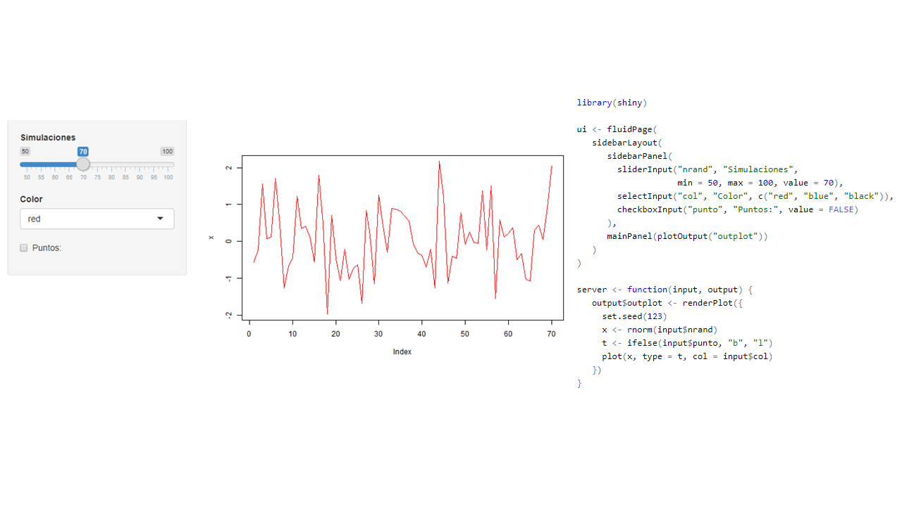
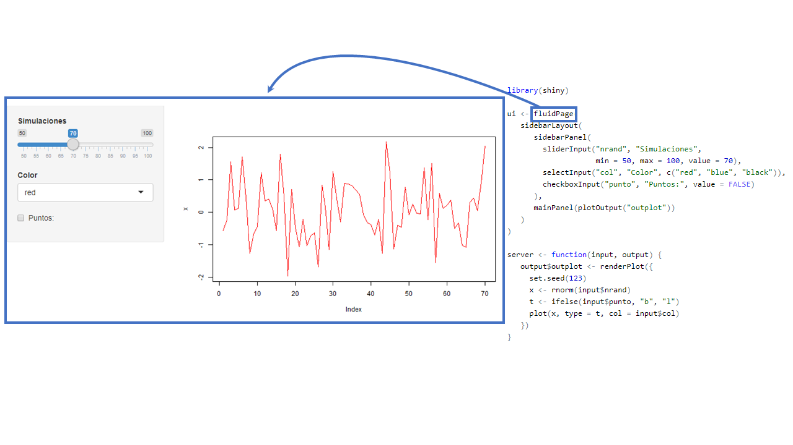
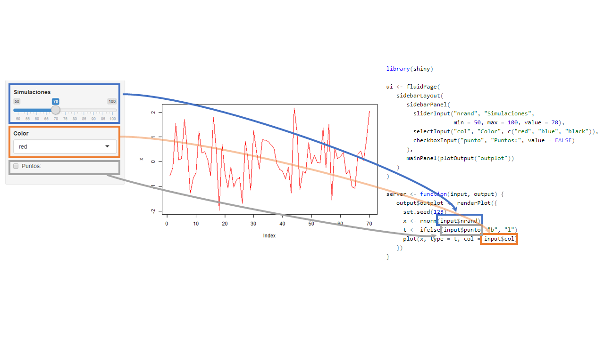

```{r setup, include=FALSE}
library(highcharter)
library(tidyverse)
file.remove(dir("wdgts/", full.names = TRUE))

knitr::opts_chunk$set(fig.path = "static/img/", echo = TRUE, cache = TRUE, message = FALSE)

options(highcharter.theme =
          hc_theme_smpl(chart = list(
            backgroundColor = "transparent",
            style = list(fontFamily = "Source Sans Pro"))
            ))
source("setup.R")
```

# <br><br>Computación Estadística con R<br><small>Clase 5 <br><br> Rubén Soza</small>{ .center .white data-background="#75AADB" }

# Regresión Lineal en R{ .center .white data-background="#75AADB" }

## Base de Datos

```{r}
fichier <- "http://www.biostatisticien.eu/springeR/Weight_birth.csv"
mydata <- read_delim(fichier, "\t", escape_double = FALSE, trim_ws = TRUE)
head(mydata)
```

## Modelo de regresión lineal simple

```{r, fig.height= 4}
model1 <- lm(BWT ~ LWT, data = mydata)
summary(model1)
```

## Veamos un ejemplo en R!{ .center .white data-background="#75AADB" }


## Regresión Lineal Múltiple

<p align = "justify"> El modelo de regresión lineal simple busca explicar el comportamiento medio de cierta variable respuesta $y$ utilizando variables explicativas $x_1, \ldots, x_p$. </p>

<p align = "justify"> Su formulación corresponde a </p>

$$y_i = \beta_0 + \beta_1x_{1i} + \cdots + \beta_px_{pi} + \epsilon_i,$$ 

<p align = "justify"> donde $\epsilon_i \overset{i.i.d}{\sim} N(0,\sigma^2)$, $\sigma^2 \in \mathbb{R}_+, \beta_0,\beta_1, \ldots, \beta_p \in \mathbb{R}$.</p>

----

Modelaremos BWT utilizando LWT, AGE y SMOKE.

```{r, fig.height=4}
mydata1 <- mydata %>%  select(BWT,LWT,AGE,SMOKE)
library(GGally); library(Rmisc); library(ggiraph); library(ggiraphExtra)
pairs <- mydata1 %>% select(-SMOKE) %>% ggpairs()
boxplot <- mydata1 %>% ggplot() + geom_boxplot_interactive(aes(x = factor(SMOKE), y = BWT))+ theme_light()
multiplot(pairs,boxplot,cols = 2)
```

----

### Ajustando el Modelo

```{r}
model2 <- lm(BWT ~ LWT + AGE + factor(SMOKE), data = mydata1)
model2
```

----

### Resumen del Modelo

```{r}
summary(model2)
```

----

### I.C. para los Coeficientes

```{r}
confint(model2)
```

----

### Predicción

```{r}
newdata <- tibble("AGE" = 23, "LWT" = 57, "SMOKE" = 1)
predict(model2, newdata, interval = "pred")
predict(model2, newdata, interval = "confidence")
```

----

### Test de Hipótesis para Modelos Anidados

```{r}
anova(model1,model2)
```

----

```{r}
model3 <- lm(BWT ~ LWT + factor(SMOKE), data = mydata1)
anova(model3,model2)
```

----

### Variables con Más de Dos Categorías

```{r}
model4 <- lm(BWT ~ LWT + factor(RACE), data = mydata)
anova(model1,model4)
```

----

### Interacciones

```{r}
model5 <- lm(BWT ~ AGE + SMOKE, data = mydata1)
summary(model5)
```

----

```{r}
model6 <- lm(BWT ~ AGE*SMOKE, data = mydata1)
summary(model6)
```

----

```{r}
ggPredict(model5, se = TRUE, interactive = TRUE)
```

----

```{r}
ggPredict(model6, se = TRUE, interactive = TRUE)
```

## Selección de Variables

<p align = "justify">Los siguientes algoritmos implementados en `R` permiten la selección de variables:</p>

- Método Forward.
- Método Backward.
- Método Stepwise.

----

### Método Forward 

<p align = "justify"> Se parte de un modelo sencillo y luego se agregan variables con algún critero. </p>

```{r}
add1(lm(BWT ~ 1, data = mydata), BWT ~ LWT + AGE + UI + factor(SMOKE) + 
       HT + factor(FVT) + factor(PTL), test = "F")
```

----

### Método Backward

<p align = "justify"> Se parte de un modelo complejo y en cada etapa se elimina la variable menos influyente.</p>

```{r}
drop1(lm(BWT ~ LWT + AGE + UI + factor(SMOKE) + 
       HT + factor(FVT) + factor(PTL), data = mydata), test = "F")
```

----

### Método Stepwise

<p align = "justify"> Combina los dos métodos anteriores. Comienza como el de introducción progresiva, pero en cada etapa se plantea si todaslas variables introducidas deben de permanecer en el modelo. </p>

```{r}
step(lm(BWT ~ 1, data = mydata),
     BWT ~ LWT + AGE + UI + factor(SMOKE) + HT + factor(FVT) + factor(PTL), 
     direction = "both",trace = FALSE)
```

----

### Comparación de Modelos

<p align = "justify"> Existen diferentes medidas para comparar diferentes modelos de regresión: </p>

- $R^2$ ó $R^2$-ajustado.
- AIC ó BIC.

----

### $R^2$ ó $R^2$-ajustado

```{r}
r2 <- c(summary(model5)$r.squared, summary(model6)$r.squared)
r2.adj <- c(summary(model5)$adj.r.squared, summary(model6)$adj.r.squared )
r2
r2.adj
```
----

### AIC y BIC

<p align = "justify"> Se prefieren los modelos con menor AIC o BIC </p>

```{r}
AIC(model5, model6)
BIC(model5, model6)
```

## Veamos un ejemplo en R 

## Bondad del Ajuste del Modelo

<p align = "justify"> Supongamos que el modelo seleccionado corresponde al siguiente: </p>

```{r}
library(lmtest)
finalmodel <- lm(BWT ~ SMOKE + AGE + LWT + factor(RACE) + UI + HT + SMOKE:AGE, data = mydata)
coeftest(finalmodel)
```

----

###  Anásilis de Residuos

<p align = "jusitfy"> Debemos verificar que los residuos de nuestro modelo cumplen los supuestos preestablecidos. Para ello debemos verificar: </p>

- Normalidad de los residuos.
- Homocedasticidad de la varianza de los residuos.
- Residuos independientes.

----

#### Normalidad de los Residuos

```{r, fig.height= 4}
data <- tibble("fit" = finalmodel$fitted.values, "res" = finalmodel$residuals)
p1 <- ggplot(data, aes(sample = res)) + stat_qq() + stat_qq_line() 
p1
```

----

#### Homocedasticidad de la Varianza de los Residuos

```{r, fig.height = 4}
p1 <- ggplot(data) + geom_point(aes(x = fit, y = res))
p1
```

----

#### Independencia de los Residuos

```{r}
dwtest(BWT ~ SMOKE + AGE + LWT + factor(RACE) + UI + HT + SMOKE:AGE, data = mydata)
```

----

### Identificación de Outliers

```{r, fig.height=4, size= 1}
library(ggrepel)
data <- data %>% mutate("res_stud" = rstudent(finalmodel), labels = seq(1,nrow(data))) 
ggplot(data, aes(x = fit, y = res_stud, label = labels)) + geom_point() +
  geom_hline(yintercept = qnorm(0.025)) + geom_hline(yintercept = qnorm(0.975)) +
  geom_text(hjust = 1.5, size = 2.5, check_overlap = TRUE) + xlab("Valores ajustados") + 
  ylab("Residuos Studentizados")

```

----

### Identificación de Puntos Influyentes

<p align = "justify"> Algunos test para su detección son:</p>

- Distancia de Cook.
- DFFITS.
- DFBETAS.
- COVRATIO.

---- 

```{r}
summary(influence.measures(finalmodel))
```

## Actividad I

<p align = "justify">
Responda las preguntas del archivo Actividad II.Rmd en los espacios señalados. </p>

# Introducción a ShinyR{ .center .white data-background="#75AADB" }

## Antes de Partir

Necesitaremos algunos paquetes: 

```{r, eval=FALSE}
install.packages(
  c("tidyverse", "shiny", "shinythemes", "shinyWidgets",
    "shinydashboard", "DT", "leaflet", "plotly")
  )
```

## ¿Qué es una __app__(licación) web?

(Wikipedia:) Herramientas que los usuarios pueden utilizar accediendo 
a un servidor web a través de internet o de una intranet mediante un navegador.


## Aplicación Web

Las apps poseen **inputs** y **outputs**:

Veamos el siguiente link: https://ruben-soza.shinyapps.io/actividades/

## La estructura de una ShinyApp

```{r, eval=FALSE}
library(shiny)

ui <- fluidPage()

server <- function(input, output) {}

runApp(list(ui = ui, server = server)) 
```


## La estructura de una ShinyApp


- Se define una interfaz de usuario (user interface). En adelante `ui`
- En este caso es una página fluida vacía `fluidPage()`
- En el futuro acá definiremos diseño/estructura de nuestra aplicación (_layout_).
Que se refiere la disposición de nuestros `inputs` y `outputs`


## La estructura de una ShinyApp


- Se define el `server` en donde estará toda la lógica de nuestra aplicación.
- Principalmente serán instrucciones que dependeran de `inputs` 


## La estructura de una ShinyApp


- `runApp` es la funcion que crea y deja corriendo la app con los 
parámetros otorgados.
- **No siempre** tendremos que escribirla pues veremos que RStudio
al crear una shinyApp nos pondrá un botón para _servir_ la aplicación

## Ejercicio:

Hacer funcionar el siguiente código en R Rstudio:

```{r, eval=FALSE}
ui <- fluidPage(
   sidebarLayout(
      sidebarPanel(
        sliderInput("nrand", "Simulaciones",
                    min = 50, max = 100, value = 70),
        selectInput("col", "Color", c("red", "blue", "black")),
        checkboxInput("punto", "Puntos:", value = FALSE)
      ),
      mainPanel(plotOutput("outplot"))
   )
)

server <- function(input, output) {
   output$outplot <- renderPlot({
     set.seed(123)
     x <- rnorm(input$nrand)
     t <- ifelse(input$punto, "b", "l")
     plot(x, type = t, col = input$col)
   })
}
(ui = ui, server = server)
```

## Funcionamiento de una app de Shiny{ .center .white data-background="#75AADB" }

## App



## Contenedor 



## Otros contenedores 


## Inputs 


## Outputs


## Interacción 



## Resultado


## La estructura de una ShinyApp 2{ .center .white data-background="#75AADB" }

## 


- `fluidPage`, `sidebarLayout`, `sidebarPanel`, `mainPanel` definen el diseño/_layout_ de nuestra app
-  Existen muchas más formas de organizar una app. Más detalles en http://shiny.rstudio.com/articles/layout-guide.html

----


- `sliderInput`, `selectInput`, `checkboxInput` son los inputs de nuestra app,
con esto el usuario puede interactuar con nuestra aplicación.
- Estas funciones generan el input deseado en la app y shiny permite que los
valores de estos inputs sean usados como valores usuales en R en la parte del server
(numericos, strings, booleanos, fechas).

----


- `plotOutput` define el lugar donde la salida estará
- Como mencionamos, nuestras app pueden tener muchos outputs: tablas, texto, imágenes

----


- `renderPlot` define un tipo de salida gráfica
- Existen otros tipos de salidas, como tablas `tableOutput` o tablas más interactivas como 
`DT::DTOutput`

----


- Este espacio determina la lógica de nuestra salida 
- Acá haremos uso de los inputs para entregar lo que deseamos

## Interacción entre Inputs y Outputs{ .center .white data-background="#75AADB" }

----
<pre class="r hljs remark-code">
ui <- fluidPage(                                                                                          
   sidebarLayout(                                                 
      sidebarPanel(                                               
        sliderInput("nrand", "Simulaciones",                       
                    min = 50, max = 100, value = 70),             
        selectInput("col", "Color", c("red", "blue", "black")),   
        checkboxInput("punto", "Puntos:", value = FALSE)          
      ),
      mainPanel(<b>plotOutput</b>("outplot"))
   )
)

server <- function(input, output) {
   output$outplot <- <b>renderPlot</b>({                               
     set.seed(123)                                              
     x <- rnorm(input$nrand)                                    
     t <- ifelse(input$punto, "b", "l")                         
     plot(x, type = t, col = input$col)                         
   })
}
</pre>

- Las funciones `Output()` y `render()` trabajan juntas para agregar salidas de R a la
interfaz de usuario
- En este caso `renderPlot` esta asociado con `plotOutput` (¿cómo?)
- Existen más parejas: `renderText`/`textOutput` o `renderTable`/`tableOutput`.

----

<pre class="r hljs remark-code">
ui <- fluidPage(                                                                                          
   sidebarLayout(                                                 
      sidebarPanel(                                               
        sliderInput("nrand", "Simulaciones",                       
                    min = 50, max = 100, value = 70),             
        selectInput("col", "Color", c("red", "blue", "black")),   
        checkboxInput("punto", "Puntos:", value = FALSE)          
      ),
      mainPanel(plotOutput(<b>"outplot"</b>))
   )
)

server <- function(input, output) {
   output$<b>outplot</b> <- renderPlot({                               
     set.seed(123)                                              
     x <- rnorm(input$nrand)                                    
     t <- ifelse(input$punto, "b", "l")                         
     plot(x, type = t, col = input$col)                         
   })
}
</pre>

- Cada `Output()` y `render()` se asocian con un **id**
- Este **id** debe ser único en la applicación
- En el ejemplo `renderPlot` esta asociado con `plotOutput` vía el `outplot`

----
<pre class="r hljs remark-code">
ui <- fluidPage(                                                                                          
   sidebarLayout(                                                 
      sidebarPanel(                                               
        sliderInput(<b>"nrand"</b>, "Simulaciones",                       
                    min = 50, max = 100, value = 70),             
        selectInput("col", "Color", c("red", "blue", "black")),   
        checkboxInput("punto", "Puntos:", value = FALSE)          
      ),
      mainPanel(plotOutput("outplot"))
   )
)

server <- function(input, output) {
   output$outplot <- renderPlot({                               
     set.seed(123)                                              
     x <- rnorm(input$<b>nrand</b>)                                    
     t <- ifelse(input$punto, "b", "l")                         
     plot(x, type = t, col = input$col)                         
   })
}
</pre>

- Cada functión `Input` requiere un **id** para ser identificado en el server
- Cada `Input` requiere argumentos especificos a cada tipo de input, valor por defecto,
etiquetas, opciones, rangos, etc

----

- Acá, el valor númerico ingresado/modificado por el usuario se puede 
acceder en el server bajo `input$nrand`

----

<pre class="r hljs remark-code">
ui <- fluidPage(                                                                                          
   sidebarLayout(                                                 
      sidebarPanel(                                               
        sliderInput(<b>"nrand"</b>, "Simulaciones",                       
                    min = 50, max = 100, value = 70),             
        selectInput(<b>"col"</b>, "Color", c("red", "blue", "black")),   
        checkboxInput(<b>"punto"</b>, "Puntos:", value = FALSE)          
      ),
      mainPanel(plotOutput("outplot"))
   )
)

server <- function(input, output) {
   output$outplot <- renderPlot({                               
     set.seed(123)                                              
     x <- rnorm(input$<b>nrand</b>)                                    
     t <- ifelse(input$<b>punto</b>, "b", "l")                         
     plot(x, type = t, col = input$<b>col</b>)                         
   })
}
</pre>

- `sliderInput` se usa para seleccionar un valor numérico entre un rango 
- `selectInput` otorga la posibildad que el usuario escoge entre un conjunto de valores
- `checkboxInput` en el server es un valor lógico `TRUE`/`FALSE`

----

- ¿Necesitas más? https://gallery.shinyapps.io/065-update-input-demo/ y `shinyWidgets::shinyWidgetsGallery()`
- Si deseas compartir tu ShinyApp puede ser útil https://shiny.rstudio.com/tutorial/written-tutorial/lesson7/

## Ejemplo: Análicemos un ejemplo en shiny ! { .center .white data-background="#75AADB" }

## Actividad II

Cree una app que contenga:
  - 2 inputs, un `sliderInput` y un `numericInput`.
  - 1 output que muestre el resultado de la suma entre los dos inputs anteriores.

